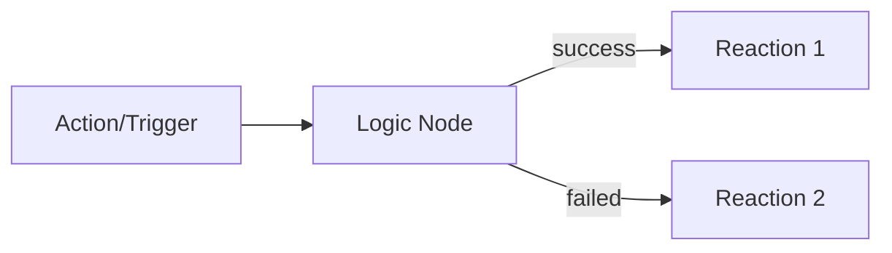
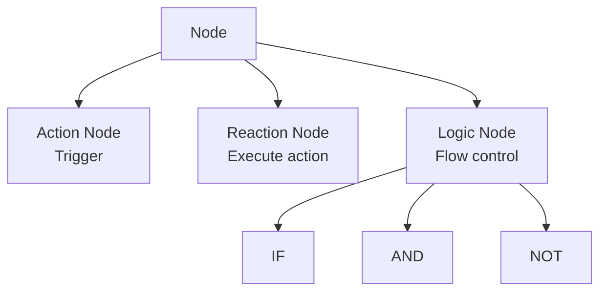
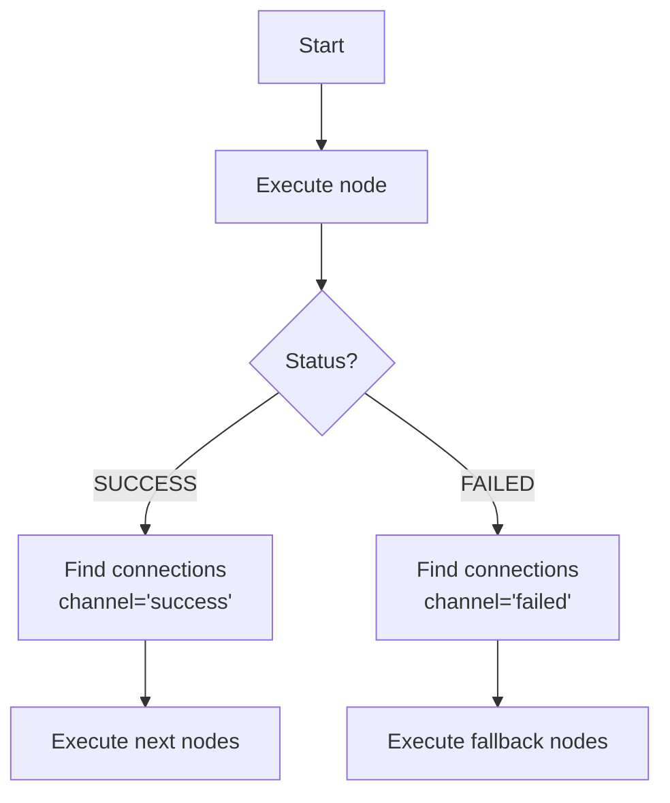
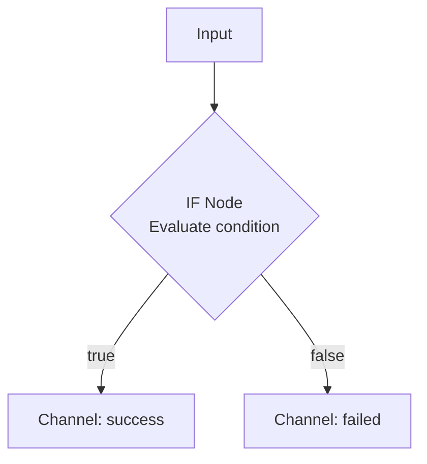
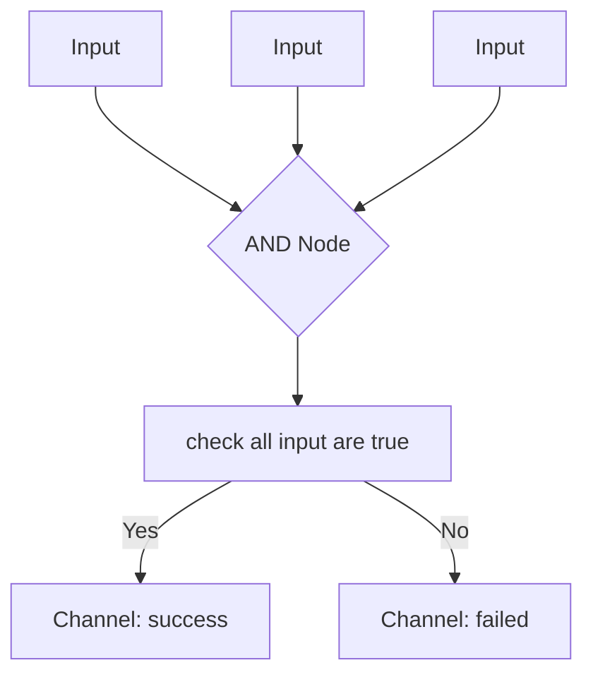
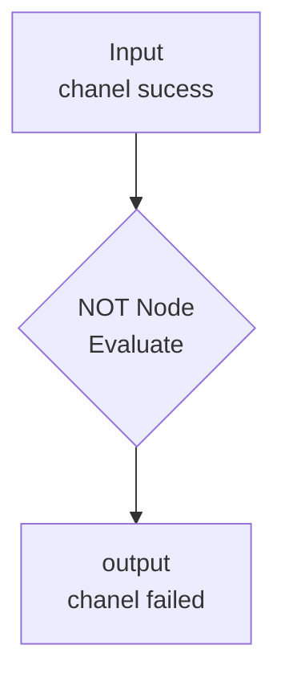

# Workflow System Documentation

## Table of Contents

1. [Overview](#overview)
2. [Node Types](#node-types)
3. [Creating Nodes](#creating-nodes)
4. [Node Connections](#node-connections)
5. [Channel System](#channel-system)
6. [Logic Nodes](#logic-nodes)
7. [API ENDPOINTS](#api-endpoints)

---

## Overview

A workflow is composed of connected nodes that execute sequentially based on channels.



---

## Node Types



### Node Structure

| Property      | Type       | Description               |
| ------------- | ---------- | ------------------------- |
| `name`        | String     | Node name                 |
| `workflowId`  | Integer    | Parent workflow ID        |
| `actionId`    | Integer?   | Action ID (for triggers)  |
| `reactionId`  | Integer?   | Reaction ID (for actions) |
| `logicType`   | LogicType? | IF, AND, or NOT           |
| `conf`        | Json?      | Node configuration        |
| `isTriggered` | Boolean    | If node is a trigger      |

---

## Creating Nodes

### Action Node (Trigger)

exemple
```json
{
  "name": "Gmail - New email",
  "actionId": 1,
  "isTriggered": true,
  "conf": {
    "filter": "from:important@example.com"
  }
}
```
actionId is a "template" table on the db /!\ work i progress here

### Reaction Node

exemple
```json
{
  "name": "Send Discord notification",
  "reactionId": 5,
  "conf": {
    "channel": "notifications",
    "message": "New email received"
  }
}
```
reactionId is a "template" table on the db /!\ work in progress here

### Logic Node

exemple
```json
{
  "name": "Check importance",
  "logicType": "IF",
  "conf": {
    "condition": {
      "operator": "==",
      "left": "${priority}",
      "right": "high"
    }
  }
}
```

---

## Node Connections

### Connection Structure

```json
{
  "sourceNodeId": 1,
  "targetNodeId": 2,
  "channel": "success" //<-- this is optional on the sucess channel, can be failed or a custom value on complex workflows more infos if you scroll down a bit :)
}
```

### Connection Rules

-  A node can have multiple outgoing connections
-  A node can have multiple incoming connections
-  A node cannot connect to itself
-  Duplicate connections (same source, target, channel) are not allowed


## Channel System

Channels determine the execution path after a node completes.

### default Available Channels

| Channel   | Description                         | Usage              |
| --------- | ----------------------------------- | ------------------ |
| `success` | Successful execution (default)      | All nodes          |
| `failed`  | Failed execution or false condition | Mainly logic nodes |

### Execution Flow



---

## Logic Nodes

### 1. IF Node

Evaluates a condition and routes to `success` or `failed` channel.

#### Configuration

```json
{
  "logicType": "IF",
  "conf": {
    "condition": "${x} > 2"
  }
}
```

#### Flow



#### Condition Types

**Boolean:**
```json
{"condition": true}
```

**String expression:**
```json
{"condition": "${temperature} > 25"}
```

**Object:**
```json
{
  "condition": {
    "operator": "==",
    "left": "${status}",
    "right": "active"
  }
}
```

**Supported operators:** `==`, `!=`, `>`, `<`, `>=`, `<=`

---

---

### 2. AND Node

Evaluates multiple inputs, all must be true.

#### Configuration

```json
{
  "logicType": "AND",
  "conf": {}
}
```

#### Flow



---

### 3. NOT Node

Inverts the value of it first input result.

#### Configuration

```json
{
  "logicType": "NOT",
  "conf": {}
}
```

#### Flow



---


# API Endpoints

| type | route | description|
|-|-|-|
|POST   |/workflows/{workflowId}/nodes| create a node
|GET    |/workflows/{workflowId}/nodes| get all nodes of the workflow
|GET    |/workflows/{workflowId}/nodes/{nodeId}| get infos about a specific node
|PATCH  |/workflows/{workflowId}/nodes/{nodeId}| change node infos
|DELETE |/workflows/{workflowId}/nodes/{nodeId}| delete a node
|POST   |/workflows/{workflowId}/nodes/{nodeId}/execute| execute the workflow starting by this node
|POST   |/workflows/{workflowId}/connections| create a connection on beetween two nodes
|GET    |/workflows/{workflowId}/connections| get all connections on a workflow
|GET    |/workflows/{workflowId}/connections/{connectionId}| get a specific connection
|PATCH  |/workflows/{workflowId}/connections/{connectionId}| change a connection
|DELETE |/workflows/{workflowId}/connections/{connectionId}| delete a connection
